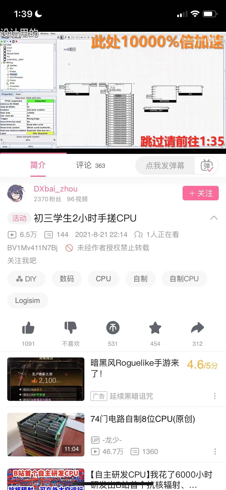

# cpu

[超标量处理器设计 (豆瓣) (douban.com)](https://book.douban.com/subject/26293546/)

我是个大废物。又老又废。很多初中生就开始做 CPU 了。

值得参考的项目

- 香山 RISC-V CPU (入门门槛比 Verilog 低)
- [The Design of a Custom 32-bit RISC CPU and LLVM Compiler Backend (rit.edu)](https://scholarworks.rit.edu/cgi/viewcontent.cgi?article=10699&context=theses)
- [Cpu0 architecture and LLVM structure — Tutorial: Creating an LLVM Backend for the Cpu0 Architecture (jonathan2251.github.io)](https://jonathan2251.github.io/lbd/llvmstructure.html)

